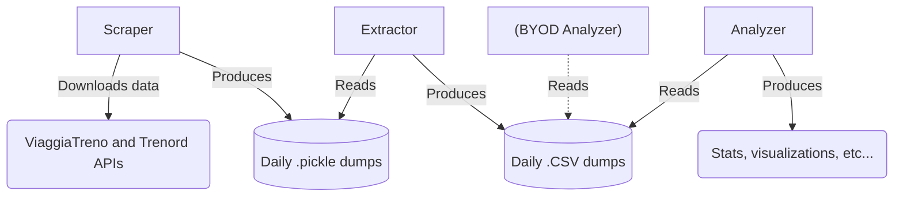

# railway-opendata

In Italy there are no available official **Open Data** about the _performance_ (delays, cancellations, ...) of the **italian public rail transport**.
This project offers a tool which allows anyone to gather it and run some stats and visualizations.

## Architecture



The application is composed by multiple modules, accessible via CLI:
- **`scraper`**: unattended script to incrementally download and preserve the current status of the italian railway network. If run constantly (e.g. ~every hour using `cron`) all trains will be captured and saved in `data/%Y-%m-%d/trains.pickle`.
- **`train-extractor`** and **`station-extractor`**: converts raw scraped data to usable `.csv` files;
- **`analyze`** : shows reproducible stats and visualizations.

## Running

The project is written in Python and it uses modern typing annotations, so **Python >= 3.11** is needed.

### Using virtual envs

> ⚠️ __WARNING__: this project currently uses the builtin `hash(...)` function to quickly index objects.
> To ensure reproducibility between runs, you need to disable Python's **hash seed randomization** by setting the `PYTHONHASHSEED=0` environment variable.
> If you fail to do so, the software will refuse to start.

```bash
$ export PYTHONHASHSEED=0
$ virtualenv venv
$ source ./venv/bin/activate
$ pip install -r requirements.txt
$ python main.py ...
```

### Using Docker

(TODO)

## Usage

Example usages.

- __Start the scraper__. For continuos data collection, it should be run every ~hour.

    `$ python main.py scraper`

- __Extract train data__ from a pickle file and save it in CSV.

    `$ python main.py train-extractor -o data/2023/04-29/trains.csv data/2023-04-29/trains.pickle`

- __Extract station data__ from a pickle file and save it in GeoJSON.

    `$ python main.py station-extractor -f geojson data/stations.pickle`

## Fields

### Stations CSV

| Column | Data type | Description | Notes |
|--------|-----------|-------------|-------|
| `code` | String | Station code | This field is not actually unique. One station can have multiple codes |
| `region` | Integer | Region code | If zero, unknown. Used in API calls |
| `long_name` | String | Station long name | |
| `short_name` | String | Station short name | Can be empty |
| `latitude` | Float | Station latitude | Can be empty |
| `longitude` | Float | Station longitude | Can be empty |

### Trains CSV
In the extracted trains CSV, each line is a _train stop_ (not station nor train).
Many fields are actually duplicated.

| Column | Data type | Description | Notes |
|--------|-----------|-------------|-------|
| `train_hash` | MD5 hash | Unique identifier for a particular train | |
| `number` | Integer | Train number | Can't be used to uniquely identify a train[^train_number_unique] |
| `day` | Date | Train departing date | |
| `origin` | Station (code) | Train absolute origin | |
| `category` | String | Train Category | See table[^categories] |
| `destination` | Station (code) | Train final destination | |
| `client_code` | Integer | Railway company | See table[^client_codes] |
| `phantom` | Boolean | True if train was only partially fetched | Trains with this flag should be safely ignored |
| `trenord_phantom` | Boolean | True if the train was only partially fetched using Trenord APIs | Trains with this flag should be safely ignored[^trenord_phantom] |
| `cancelled` | Boolean | True if the train is marked as cancelled | Not all cancelled trains are marked as cancelled: for more accuracy, you should always check `stop_type` |
| `stop_number` | Integer | Stop progressive number (starting at 0) | |
| `stop_station_code` | Station (code) | Stop station code | |
| `stop_type` | Char | Stop type | `P` if first, `F` if intermediate, `A` if last, `C` if cancelled |
| `platform` | String | Stop platform | Can be empty |
| `arrival_expected` | ISO 8601 | Stop expected arrival time | Can be empty |
| `arrival_actual` | ISO 8601 | Stop actual arriving time | Can be empty |
| `arrival_delay` | Integer | Stop arriving delay in minutes | Is empty if `arrival_expected` or `arrival_actual` are both empty |
| `departure_expected` | ISO 8601 | Stop expected departing time | Can be empty |
| `departure_actual` | ISO 8601 | Stop actual departing time | Can be empty |
| `departure_delay` | Integer | Stop departing delay in minutes | Is empty if `departing_expected` or `departing_actual` are both empty |
| `crowding` | Integer | Train crowding in percentage | Reported by Trenord |

[^train_number_unique]: In Italy, two different trains can share the same number. A train is only uniquely identified by the triple (number, origin, day).

[^categories]: Known categories are listed below.

    | Category | Description |
    |----------|-------------|
    | REG | Regional trains |
    | MET | Metropolitan trains |
    | FR | Frecciarossa (red arrow) |
    | IC | Intercity |
    | ICN | Intercity Night |
    | EC | Eurocity |
    | FB | Frecciabianca (white arrow) |
    | FA | Frecciargento (silver arrow) |
    | EN | EuroNight |
    | EC ER | Eurocity |

[^client_codes]: Known client codes are listed below.

    | Client code | Railway company |
    |-------------|-----------------|
    | 1 | TRENITALIA_AV |
    | 2 | TRENITALIA_REG |
    | 4 | TRENITALIA_IC |
    | 18 | TPER |
    | 63 | TRENORD |
    | 64 | OBB |

[^trenord_phantom]: This flag is activated when a train is seen on ViaggiaTreno APIs and marked as Trenord's but it can't be fetched on Trenord's APIs.

## Contributing

See [CONTRIBUTING.md](CONTRIBUTING.md).

## Notes and caveats

### Data completeness and correctness

The [ViaggiaTreno](https://viaggiatreno.it) APIs are [known](https://medium.com/@albigiu/trenitalia-shock-non-crederete-mai-a-queste-api-painful-14433096502c) to be **buggy** and **unreliable**.
As stated before, many fields (like `departure_expected` and `arrival_expected`) are not always guaranteed to be present and some concepts are counter-intuitive (a train number is not an unique identifier nor are station codes).

ViaggiaTreno is the main _source of truth_ for many final user applications (like [Trenìt!](https://play.google.com/store/apps/details?id=eu.baroncelli.oraritrenitalia) or [Orario Treni](https://play.google.com/store/apps/details?id=org.paoloconte.treni_lite)) and is itself linked on the Trenitalia official website.
For instance, if the API does not return information for a train stop, no other application will display it: the data simply does not exists online.
The scraper always tries to save as much data as possible (___"best effort"___) even when is probably incomplete; in those cases, proper flags (like `phantom` and `trenord_phantom`) are activated so the developer can choose for themselves.

### Licensing

Copyright (c) 2023 Marco Aceti. Some rights reserved (see [LICENSE](./LICENSE)).

Terms and conditions of the ViaggiaTreno web portal state that copying is prohibited (except for personal use) as **all rights for the content are reserved** to the original owner (Trenitalia or Gruppo FS).
In July 2019 Trenitalia sued Trenìt for using train data in its app, but [partially lost](https://www.wired.it/lifestyle/mobilita/2019/09/06/trenitalia-tornata-online-trenit/).
I think data about the performance of __public__ transport should be __open__ as well, but I'm not a lawyer and I'm not willing to risk lawsuits redistributing data; if someone wants to, the tool is now available.

BECAUSE THE PROGRAM IS LICENSED FREE OF CHARGE, THERE IS NO WARRANTY FOR THE PROGRAM, TO THE EXTENT PERMITTED BY APPLICABLE LAW.
EXCEPT WHEN OTHERWISE STATED IN WRITING THE COPYRIGHT HOLDERS AND/OR OTHER PARTIES PROVIDE THE PROGRAM "AS IS" WITHOUT WARRANTY OF ANY KIND, EITHER EXPRESSED OR IMPLIED, INCLUDING, BUT NOT LIMITED TO, THE IMPLIED WARRANTIES OF MERCHANTABILITY AND FITNESS FOR A PARTICULAR PURPOSE.
THE ENTIRE RISK AS TO THE QUALITY AND PERFORMANCE OF THE PROGRAM IS WITH YOU.
SHOULD THE PROGRAM PROVE DEFECTIVE, YOU ASSUME THE COST OF ALL NECESSARY SERVICING, REPAIR OR CORRECTION.

IN NO EVENT UNLESS REQUIRED BY APPLICABLE LAW OR AGREED TO IN WRITING WILL ANY COPYRIGHT HOLDER, OR ANY OTHER PARTY WHO MAY MODIFY AND/OR REDISTRIBUTE THE PROGRAM AS PERMITTED ABOVE, BE LIABLE TO YOU FOR DAMAGES, INCLUDING ANY GENERAL, SPECIAL, INCIDENTAL OR CONSEQUENTIAL DAMAGES ARISING OUT OF THE USE OR INABILITY TO USE THE PROGRAM (INCLUDING BUT NOT LIMITED TO LOSS OF DATA OR DATA BEING RENDERED INACCURATE OR LOSSES SUSTAINED BY YOU OR THIRD PARTIES OR A FAILURE OF THE PROGRAM TO OPERATE WITH ANY OTHER PROGRAMS), EVEN IF SUCH HOLDER OR OTHER PARTY HAS BEEN ADVISED OF THE POSSIBILITY OF SUCH DAMAGES.
